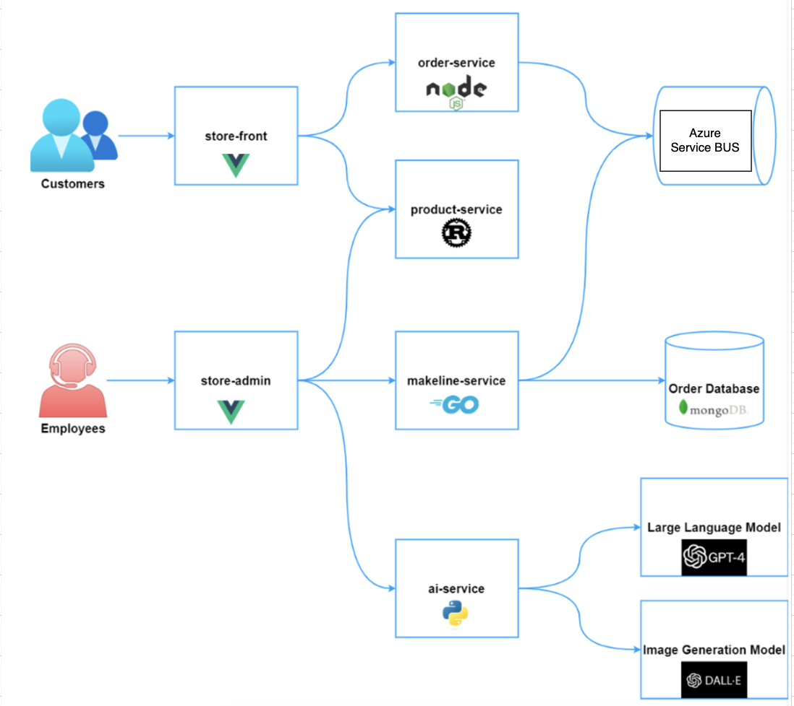
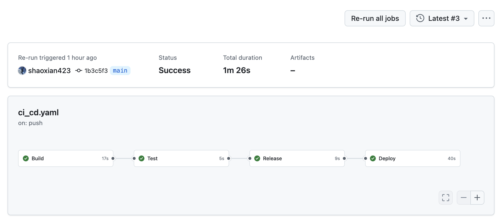
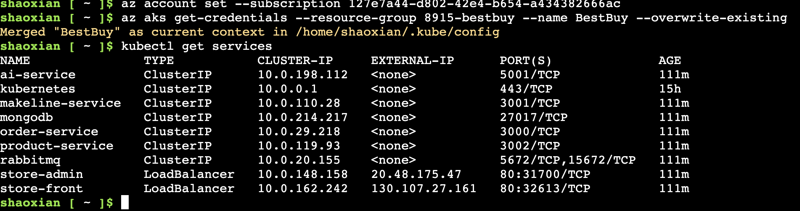
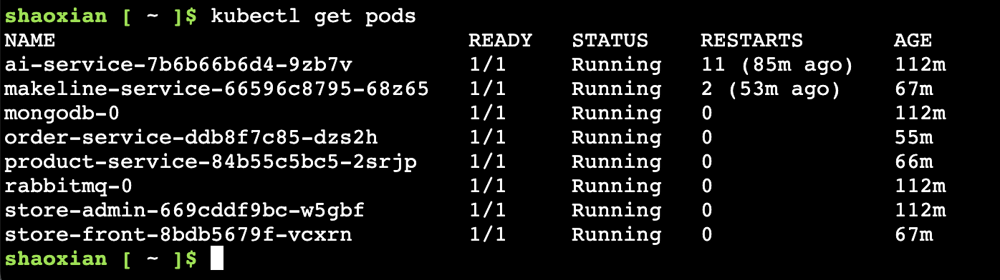

# 🛍️ Best Buy Cloud-Native App 

This project is a Kubernetes-based microservices demo application for Best Buy, enhanced with Azure Service Bus for managed queueing and OpenAI APIs for AI features.

🔄 Forked and extended from: [Algonquin Pet Store - On Steroids](https://github.com/ramymohamed10/Lab9_24F_CST8915)

---

## 📐 Architecture Overview



### Core Features

- 🧾 Customer orders go through `store-front` ➝ `order-service` ➝ Azure Service Bus
- 🏭 Employees manage orders through `store-admin` ➝ `makeline-service`
- 🤖 `ai-service` integrates GPT-4 and DALL·E for smart description and image generation
- 🧊 All order data is stored in MongoDB
- 🐳 All services are Dockerized and pushed to Docker Hub
- ⚙️ GitHub Actions handles **CI/CD pipeline** with build, test, release, and deploy

---

## 📦 Microservice Repositories

| Service           | Language | GitHub Repo |
|-------------------|----------|-------------|
| 🛒 store-front     | Vue.js   | [store-front-L8](https://github.com/shaoxian423/store-front-L8) |
| 🧑‍💼 store-admin     | Vue.js   | [store-admin-L8](https://github.com/shaoxian423/store-admin-L8) |
| 📦 order-service    | Node.js  | [order-service-L8](https://github.com/shaoxian423/order-service-L8) |
| 📚 product-service  | Rust     | [product-service-L8](https://github.com/shaoxian423/product-service-L8) |
| 🏭 makeline-service | Go       | [makeline-service-L8](https://github.com/shaoxian423/makeline-service-L8) |
| 🧠 ai-service       | Python   | [ai-service-L8](https://github.com/shaoxian423/ai-service-L8) |

---

## 🚀 Demo

🎬 Watch the full demo on YouTube: [https://www.youtube.com/watch?v=BZXKxQd015Q](https://www.youtube.com/watch?v=BZXKxQd015Q)

🎥 **In this demo**:
- Customers place orders via the front-end
- Orders are sent to Azure Service Bus
- Employees fulfill orders and manage operations
- AI generates enhanced content for each product

---

## ⚙️ GitHub Actions CI/CD

Every service repo includes a `.github/workflows/ci_cd.yaml` file that:

- ✅ Builds Docker image
- ✅ Runs tests
- ✅ Pushes image to Docker Hub (`41123100/{service-name}-l9`)
- ✅ Deploys to Kubernetes using `KUBE_CONFIG_DATA`

### ✅ Secrets & Variables

Each repo contains:

| Secret Name        | Purpose               |
|--------------------|------------------------|
| `DOCKER_USERNAME`  | Docker Hub login       |
| `DOCKER_PASSWORD`  | Docker Hub password    |
| `KUBE_CONFIG_DATA` | Encoded kubeconfig     |

| Variable Name        | Example Value         |
|----------------------|------------------------|
| `DOCKER_IMAGE_NAME`  | `order-service-l9`     |
| `CONTAINER_NAME`     | `order-service`        |
| `DEPLOYMENT_NAME`    | `order-service`        |

---

## 📁 Project Structure

My root project directory includes:

```
.
├── Deployment Files/
│   ├── aps-all-in-one.yaml
│   ├── secrets.yaml
│   ├── config-maps.yaml
├── ai-service-L8/
├── order-service-L8/
├── product-service-L8/
├── makeline-service-L8/
├── store-front-L8/
├── store-admin-L8/
├── serviceBUS key.docx
└── README.md
```

---


---

## 📡 Kubernetes Status

Current deployment is running in **Azure Kubernetes Service (AKS)**.

### 🧩 Services



### 📦 Pods




## 🛠️ Quick Start

```bash
# 1. Clone this repo
git clone https://github.com/shaoxian423/bestbuy-cloud-lab9.git
cd bestbuy-cloud-lab9

# 2. Apply K8s resources
kubectl apply -f aps-all-in-one.yaml          # Deploy all services
kubectl apply -f secrets.yaml                 # Add API keys (base64 encoded)
kubectl apply -f config-maps.yaml             # Configurations

# 3. Access UI
# Use kubectl port-forward or NodePort to access frontend
```

---

## 📚 References

- [Azure Service Bus Docs](https://learn.microsoft.com/en-us/azure/service-bus-messaging/)
- [OpenAI GPT-4](https://openai.com/gpt-4)
- [DALL·E](https://openai.com/dall-e)
- [MongoDB Kubernetes Helm](https://artifacthub.io/packages/helm/bitnami/mongodb)

---

## 👨‍💻 Author

Shaoxian Duan  
Algonquin college
